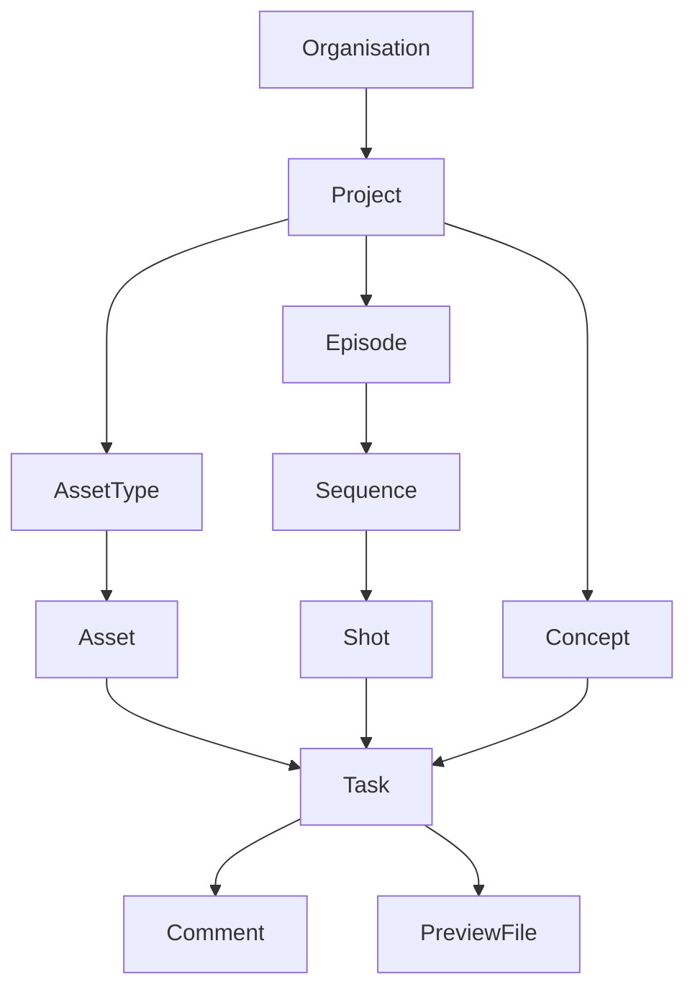

# Data Models

Every entity returned by the Kitsu API (or the Gazu Python client) is a
dictionary. This page lists all available fields for each model. Every dict
includes `id` (string), `created_at`, and `updated_at` (ISO 8601 timestamps).

## Project

### Project

| Field | Type | Default |
|---|---|---|
| `name` | string | |
| `code` | string | |
| `description` | string | |
| `file_tree` | dict | |
| `data` | dict | |
| `has_avatar` | bool | `false` |
| `fps` | string | `"25"` |
| `ratio` | string | `"16:9"` |
| `resolution` | string | `"1920x1080"` |
| `production_type` | string (`"short"`, `"featurefilm"`, `"tvshow"`) | `"short"` |
| `production_style` | string (`"2d"`, `"3d"`, `"2d3d"`, `"ar"`, `"vfx"`, `"stop-motion"`, `"motion-design"`, `"archviz"`, `"commercial"`, `"catalog"`, `"nft"`, `"video-game"`, `"immersive"`) | `"2d3d"` |
| `start_date` | string (date) | |
| `end_date` | string (date) | |
| `man_days` | int | |
| `nb_episodes` | int | `0` |
| `episode_span` | int | `0` |
| `max_retakes` | int | `0` |
| `is_clients_isolated` | bool | `false` |
| `is_preview_download_allowed` | bool | `false` |
| `is_set_preview_automated` | bool | `false` |
| `homepage` | string | `"assets"` |
| `is_publish_default_for_artists` | bool | `false` |
| `hd_bitrate_compression` | int | `28` |
| `ld_bitrate_compression` | int | `6` |
| `project_status_id` | string (UUID) | |
| `project_status_name` | string | |
| `default_preview_background_file_id` | string (UUID) | |
| `team` | list of person IDs | |
| `asset_types` | list of entity type IDs | |
| `task_statuses` | list of task status IDs | |
| `task_types` | list of task type IDs | |

### ProjectStatus

| Field | Type | Default |
|---|---|---|
| `name` | string | |
| `color` | string (hex) | |

## Entity

### Entity

Entities represent assets, shots, sequences, episodes, and scenes. The
`entity_type_id` determines which kind of entity it is.

| Field | Type | Default |
|---|---|---|
| `name` | string | |
| `code` | string | |
| `description` | string | |
| `canceled` | bool | `false` |
| `nb_frames` | int | |
| `nb_entities_out` | int | `0` |
| `is_casting_standby` | bool | `false` |
| `is_shared` | bool | `false` |
| `status` | string (`"standby"`, `"running"`, `"complete"`, `"canceled"`) | `"running"` |
| `project_id` | string (UUID) | |
| `entity_type_id` | string (UUID) | |
| `parent_id` | string (UUID) | |
| `source_id` | string (UUID) | |
| `preview_file_id` | string (UUID) | |
| `data` | dict | |
| `ready_for` | string (UUID, task type) | |
| `created_by` | string (UUID, person) | |
| `entities_out` | list of entity IDs | |

### EntityType

Used for asset types (Character, Prop, Environment, etc.) and built-in types
(Shot, Sequence, Episode, Scene).

| Field | Type | Default |
|---|---|---|
| `name` | string | |
| `short_name` | string | |
| `description` | string | |
| `archived` | bool | `false` |
| `task_types` | list of task type IDs | |

### EntityLink

Represents relationships between entities (e.g. casting: which assets appear
in which shots).

| Field | Type | Default |
|---|---|---|
| `entity_in_id` | string (UUID) | |
| `entity_out_id` | string (UUID) | |
| `data` | dict | |
| `nb_occurences` | int | `1` |
| `label` | string | `""` |

### AssetInstance

A specific instance of an asset placed in a shot or scene.

| Field | Type | Default |
|---|---|---|
| `asset_id` | string (UUID) | |
| `name` | string | |
| `number` | int | |
| `description` | string | |
| `active` | bool | `true` |
| `data` | dict | |
| `scene_id` | string (UUID) | |
| `target_asset_id` | string (UUID) | |

## Task

### Task

| Field | Type | Default |
|---|---|---|
| `name` | string | |
| `description` | string | |
| `priority` | int | `0` |
| `difficulty` | int | `3` |
| `duration` | float | `0` |
| `estimation` | float | `0` |
| `completion_rate` | int | `0` |
| `retake_count` | int | `0` |
| `sort_order` | int | `0` |
| `start_date` | string (datetime) | |
| `due_date` | string (datetime) | |
| `real_start_date` | string (datetime) | |
| `end_date` | string (datetime) | |
| `done_date` | string (datetime) | |
| `last_comment_date` | string (datetime) | |
| `nb_assets_ready` | int | `0` |
| `data` | dict | |
| `nb_drawings` | int | `0` |
| `last_preview_file_id` | string (UUID) | |
| `project_id` | string (UUID) | |
| `task_type_id` | string (UUID) | |
| `task_status_id` | string (UUID) | |
| `entity_id` | string (UUID) | |
| `assigner_id` | string (UUID) | |
| `assignees` | list of person IDs | |

### TaskType

| Field | Type | Default |
|---|---|---|
| `name` | string | |
| `short_name` | string | |
| `description` | string | |
| `color` | string (hex) | `"#FFFFFF"` |
| `priority` | int | `1` |
| `for_entity` | string | `"Asset"` |
| `allow_timelog` | bool | `true` |
| `archived` | bool | `false` |
| `department_id` | string (UUID) | |

### TaskStatus

| Field | Type | Default |
|---|---|---|
| `name` | string | |
| `short_name` | string | |
| `description` | string | |
| `color` | string (hex) | |
| `priority` | int | `1` |
| `is_done` | bool | `false` |
| `is_artist_allowed` | bool | `true` |
| `is_client_allowed` | bool | `true` |
| `is_retake` | bool | `false` |
| `is_feedback_request` | bool | `false` |
| `is_default` | bool | `false` |
| `is_wip` | bool | `false` |
| `for_concept` | bool | `false` |
| `archived` | bool | `false` |

### StatusAutomation

| Field | Type | Default |
|---|---|---|
| `entity_type` | string | `"asset"` |
| `in_task_type_id` | string (UUID) | |
| `in_task_status_id` | string (UUID) | |
| `out_field_type` | string (`"status"`, `"ready_for"`) | `"status"` |
| `out_task_type_id` | string (UUID) | |
| `out_task_status_id` | string (UUID) | |
| `import_last_revision` | bool | `false` |
| `archived` | bool | `false` |

### TimeSpent

| Field | Type | Default |
|---|---|---|
| `duration` | float | |
| `date` | string (date) | |
| `task_id` | string (UUID) | |
| `person_id` | string (UUID) | |

## Comment

### Comment

| Field | Type | Default |
|---|---|---|
| `object_id` | string (UUID) | |
| `object_type` | string | |
| `text` | string | |
| `data` | dict | |
| `replies` | list of dicts | `[]` |
| `checklist` | list of dicts | |
| `pinned` | bool | |
| `links` | list of strings | |
| `task_status_id` | string (UUID) | |
| `person_id` | string (UUID) | |
| `editor_id` | string (UUID) | |
| `preview_file_id` | string (UUID) | |
| `previews` | list of preview file dicts | |
| `mentions` | list of person IDs | |
| `department_mentions` | list of department IDs | |
| `acknowledgements` | list of person IDs | |
| `attachment_files` | list of attachment file dicts | |

### AttachmentFile

| Field | Type | Default |
|---|---|---|
| `name` | string | |
| `size` | int | `1` |
| `extension` | string | |
| `mimetype` | string | |
| `comment_id` | string (UUID) | |
| `reply_id` | string (UUID) | |
| `chat_message_id` | string (UUID) | |

### PreviewFile

| Field | Type | Default |
|---|---|---|
| `name` | string | |
| `original_name` | string | |
| `revision` | int | `1` |
| `position` | int | `1` |
| `extension` | string | |
| `description` | string | |
| `path` | string | |
| `source` | string | |
| `file_size` | int | `0` |
| `status` | string (`"processing"`, `"ready"`, `"broken"`) | `"processing"` |
| `validation_status` | string (`"validated"`, `"rejected"`, `"neutral"`) | `"neutral"` |
| `annotations` | dict | |
| `width` | int | `0` |
| `height` | int | `0` |
| `duration` | float | `0` |
| `data` | dict | |
| `task_id` | string (UUID) | |
| `person_id` | string (UUID) | |
| `source_file_id` | string (UUID) | |

### PreviewBackgroundFile

| Field | Type | Default |
|---|---|---|
| `name` | string | |
| `archived` | bool | `false` |
| `is_default` | bool | `false` |
| `original_name` | string | |
| `extension` | string | |
| `file_size` | int | `0` |

## File

### WorkingFile

| Field | Type | Default |
|---|---|---|
| `name` | string | |
| `description` | string | |
| `comment` | string | |
| `revision` | int | |
| `size` | int | |
| `checksum` | int | |
| `path` | string | |
| `data` | dict | |
| `task_id` | string (UUID) | |
| `entity_id` | string (UUID) | |
| `person_id` | string (UUID) | |
| `software_id` | string (UUID) | |

### OutputFile

| Field | Type | Default |
|---|---|---|
| `name` | string | |
| `canceled` | bool | `false` |
| `size` | int | |
| `checksum` | string | |
| `description` | string | |
| `comment` | string | |
| `extension` | string | |
| `revision` | int | |
| `representation` | string | |
| `nb_elements` | int | `1` |
| `source` | string | |
| `path` | string | |
| `data` | dict | |
| `file_status_id` | string (UUID) | |
| `entity_id` | string (UUID) | |
| `asset_instance_id` | string (UUID) | |
| `output_type_id` | string (UUID) | |
| `task_type_id` | string (UUID) | |
| `person_id` | string (UUID) | |
| `source_file_id` | string (UUID) | |
| `temporal_entity_id` | string (UUID) | |

### OutputType

| Field | Type | Default |
|---|---|---|
| `name` | string | |
| `short_name` | string | |

### FileStatus

| Field | Type | Default |
|---|---|---|
| `name` | string | |
| `color` | string (hex) | |

## Person and organisation

### Person

| Field | Type | Default |
|---|---|---|
| `first_name` | string | |
| `last_name` | string | |
| `full_name` | string | |
| `email` | string | |
| `phone` | string | |
| `contract_type` | string (`"open-ended"`, `"fixed-term"`, `"short-term"`, `"freelance"`, `"apprentice"`, `"internship"`) | `"open-ended"` |
| `active` | bool | `true` |
| `archived` | bool | `false` |
| `last_presence` | string (date) | |
| `desktop_login` | string | |
| `totp_enabled` | bool | `false` |
| `email_otp_enabled` | bool | `false` |
| `fido_enabled` | bool | `false` |
| `preferred_two_factor_authentication` | string (`"totp"`, `"email_otp"`, `"fido"`) | |
| `timezone` | string | |
| `locale` | string | |
| `data` | dict | |
| `role` | string (`"user"`, `"admin"`, `"supervisor"`, `"manager"`, `"client"`, `"vendor"`) | `"user"` |
| `position` | string (`"supervisor"`, `"lead"`, `"artist"`) | `"artist"` |
| `seniority` | string (`"senior"`, `"mid"`, `"junior"`) | `"mid"` |
| `daily_salary` | int | `0` |
| `has_avatar` | bool | `false` |
| `notifications_enabled` | bool | `false` |
| `notifications_slack_enabled` | bool | `false` |
| `notifications_slack_userid` | string | `""` |
| `notifications_mattermost_enabled` | bool | `false` |
| `notifications_mattermost_userid` | string | `""` |
| `notifications_discord_enabled` | bool | `false` |
| `notifications_discord_userid` | string | `""` |
| `is_bot` | bool | `false` |
| `expiration_date` | string (date) | |
| `studio_id` | string (UUID) | |
| `departments` | list of department IDs | |

### Department

| Field | Type | Default |
|---|---|---|
| `name` | string | |
| `color` | string (hex) | |
| `archived` | bool | `false` |

### Studio

| Field | Type | Default |
|---|---|---|
| `name` | string | |
| `color` | string (hex) | |
| `archived` | bool | `false` |

### Organisation

| Field | Type | Default |
|---|---|---|
| `name` | string | |
| `hours_by_day` | float | `8` |
| `has_avatar` | bool | `false` |
| `use_original_file_name` | bool | `false` |
| `timesheets_locked` | bool | `false` |
| `format_duration_in_hours` | bool | `false` |
| `hd_by_default` | bool | `false` |
| `chat_token_slack` | string | `""` |
| `chat_webhook_mattermost` | string | `""` |
| `chat_token_discord` | string | `""` |
| `dark_theme_by_default` | bool | `false` |

## Playlist

### Playlist

| Field | Type | Default |
|---|---|---|
| `name` | string | |
| `shots` | list of dicts | |
| `project_id` | string (UUID) | |
| `episode_id` | string (UUID) | |
| `task_type_id` | string (UUID) | |
| `for_client` | bool | `false` |
| `for_entity` | string | `"shot"` |
| `is_for_all` | bool | `false` |
| `created_by` | string (UUID) | |

### BuildJob

| Field | Type | Default |
|---|---|---|
| `status` | string (`"running"`, `"failed"`, `"succeeded"`) | `"running"` |
| `job_type` | string (`"archive"`, `"movie"`) | `"movie"` |
| `ended_at` | string (datetime) | |
| `playlist_id` | string (UUID) | |

## Notification

### Notification

| Field | Type | Default |
|---|---|---|
| `read` | bool | `false` |
| `change` | bool | `false` |
| `type` | string (`"comment"`, `"mention"`, `"assignation"`, `"reply"`, `"reply-mention"`, `"playlist-ready"`) | |
| `person_id` | string (UUID) | |
| `author_id` | string (UUID) | |
| `comment_id` | string (UUID) | |
| `task_id` | string (UUID) | |
| `playlist_id` | string (UUID) | |
| `reply_id` | string (UUID) | |

### News

| Field | Type | Default |
|---|---|---|
| `change` | bool | `false` |
| `author_id` | string (UUID) | |
| `comment_id` | string (UUID) | |
| `task_id` | string (UUID) | |
| `preview_file_id` | string (UUID) | |

### Subscription

| Field | Type | Default |
|---|---|---|
| `person_id` | string (UUID) | |
| `task_id` | string (UUID) | |
| `entity_id` | string (UUID) | |
| `task_type_id` | string (UUID) | |

## Chat

### Chat

| Field | Type | Default |
|---|---|---|
| `object_id` | string (UUID) | |
| `object_type` | string | `"entity"` |
| `last_message` | string (datetime) | |
| `participants` | list of person IDs | |

### ChatMessage

| Field | Type | Default |
|---|---|---|
| `chat_id` | string (UUID) | |
| `person_id` | string (UUID) | |
| `text` | string | |
| `attachment_files` | list of attachment file dicts | |

## Metadata

### MetadataDescriptor

| Field | Type | Default |
|---|---|---|
| `project_id` | string (UUID) | |
| `entity_type` | string | |
| `name` | string | |
| `data_type` | string (`"string"`, `"number"`, `"list"`, `"taglist"`, `"boolean"`, `"checklist"`) | |
| `field_name` | string | |
| `choices` | list of strings | |
| `for_client` | bool | `false` |
| `position` | int | |
| `departments` | list of department IDs | |

## Schedule and budget

### ScheduleItem

| Field | Type | Default |
|---|---|---|
| `start_date` | string (date) | |
| `end_date` | string (date) | |
| `man_days` | int | |
| `project_id` | string (UUID) | |
| `task_type_id` | string (UUID) | |
| `object_id` | string (UUID) | |

### Milestone

| Field | Type | Default |
|---|---|---|
| `date` | string (date) | |
| `name` | string | |
| `project_id` | string (UUID) | |
| `task_type_id` | string (UUID) | |

### DayOff

| Field | Type | Default |
|---|---|---|
| `date` | string (date) | |
| `end_date` | string (date) | |
| `description` | string | |
| `person_id` | string (UUID) | |

### Budget

| Field | Type | Default |
|---|---|---|
| `project_id` | string (UUID) | |
| `revision` | int | `1` |
| `name` | string | |
| `currency` | string | |

### BudgetEntry

| Field | Type | Default |
|---|---|---|
| `budget_id` | string (UUID) | |
| `department_id` | string (UUID) | |
| `person_id` | string (UUID) | |
| `start_date` | string (date) | |
| `months_duration` | int | |
| `daily_salary` | float | |
| `position` | string (`"supervisor"`, `"lead"`, `"artist"`) | `"artist"` |
| `seniority` | string (`"senior"`, `"mid"`, `"junior"`) | `"mid"` |
| `exceptions` | dict | |

### SalaryScale

| Field | Type | Default |
|---|---|---|
| `department_id` | string (UUID) | |
| `position` | string (`"supervisor"`, `"lead"`, `"artist"`) | `"artist"` |
| `seniority` | string (`"senior"`, `"mid"`, `"junior"`) | `"mid"` |
| `salary` | int | `0` |

### ProductionScheduleVersion

| Field | Type | Default |
|---|---|---|
| `name` | string | |
| `project_id` | string (UUID) | |
| `production_schedule_from` | string (UUID) | |
| `locked` | bool | `false` |
| `canceled` | bool | `false` |

### Software

| Field | Type | Default |
|---|---|---|
| `name` | string | |
| `short_name` | string | |
| `archived` | bool | `false` |
| `version` | string | |
| `file_extension` | string | |
| `secondary_extensions` | list of strings | |
| `monthly_cost` | int | `0` |
| `inventory_amount` | int | `0` |

### HardwareItem

| Field | Type | Default |
|---|---|---|
| `name` | string | |
| `short_name` | string | |
| `archived` | bool | `false` |
| `monthly_cost` | int | `0` |
| `inventory_amount` | int | `0` |

## Custom action

### CustomAction

| Field | Type | Default |
|---|---|---|
| `name` | string | |
| `url` | string | |
| `entity_type` | string | `"all"` |
| `is_ajax` | bool | `false` |

## Search

### SearchFilter

| Field | Type | Default |
|---|---|---|
| `list_type` | string | |
| `entity_type` | string | |
| `name` | string | `""` |
| `search_query` | string | `""` |
| `is_shared` | bool | `false` |
| `department_id` | string (UUID) | |
| `search_filter_group_id` | string (UUID) | |
| `person_id` | string (UUID) | |
| `project_id` | string (UUID) | |

### SearchFilterGroup

| Field | Type | Default |
|---|---|---|
| `list_type` | string | |
| `entity_type` | string | |
| `name` | string | `""` |
| `color` | string | `""` |
| `is_shared` | bool | `false` |
| `person_id` | string (UUID) | |
| `project_id` | string (UUID) | |
| `department_id` | string (UUID) | |

## System

### ApiEvent

| Field | Type | Default |
|---|---|---|
| `name` | string | |
| `user_id` | string (UUID) | |
| `project_id` | string (UUID) | |
| `data` | dict | |

### LoginLog

| Field | Type | Default |
|---|---|---|
| `person_id` | string (UUID) | |
| `ip_address` | string | |
| `origin` | string (`"web"`, `"script"`) | |

### DesktopLoginLog

| Field | Type | Default |
|---|---|---|
| `person_id` | string (UUID) | |
| `date` | string (datetime) | |

### Plugin

| Field | Type | Default |
|---|---|---|
| `plugin_id` | string | |
| `name` | string | |
| `description` | string | |
| `version` | string | |
| `maintainer_name` | string | |
| `maintainer_email` | string | |
| `website` | string | |
| `license` | string | |
| `revision` | string | |
| `frontend_project_enabled` | bool | `false` |
| `frontend_studio_enabled` | bool | `false` |
| `icon` | string | |
